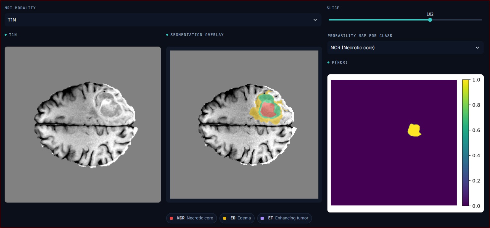

#  Brain Tumor 3D Segmentation using Deep Learning (BraTS)

A modular deep learning framework for automatic brain tumor segmentation from multi-modal MRI volumes using a **3D U-Net** architecture.

The project is built around the **BraTS (Brain Tumor Segmentation Challenge)** dataset and follows modern software engineering principles, including a modular architecture, automated tests, reproducible dataset splitting, composable preprocessing pipelines, and reusable training and inference workflows.

Rather than being a simple research prototype, the project aims to provide a maintainable and extensible codebase suitable for experimentation, education and future research.





---

##  Features

-  3D U-Net implementation for volumetric medical image segmentation
-  Native support for the BraTS dataset
-  Fully modular preprocessing pipeline
-  Configurable preprocessing transforms
    - Z-score normalization
    - Isotropic resampling
-  Training-only data augmentation
    - Random flips
    - Random 90° rotations
    - Random Gaussian noise
    - Random gamma correction
    - Random intensity shifting
-  PyTorch Dataset and DataLoader integration
-  Dice + Cross Entropy hybrid loss
-  CUDA automatic mixed precision (AMP) training
-  Tumor-aware 96³ patch sampling with NCR-focused crops
-  Sliding-window validation and inference for full MRI volumes
-  Automatic checkpoint saving and resumable training
-  Early stopping based on validation NCR Dice
-  Modular inference pipeline
-  Factory builders for reproducible component construction
-  Clean architecture with clear separation of responsibilities

---

## Project Goals

This repository was developed with three primary objectives:

1. Build a complete medical image segmentation framework following modern software engineering practices.

2. Provide a reusable and extensible codebase for future experimentation with novel architectures, preprocessing techniques and loss functions.

3. Demonstrate professional Python development skills through clean architecture, testing and documentation.

---

## Main Technologies

| Category | Technology |
|-----------|------------|
| Language | Python 3.11 |
| Deep Learning | PyTorch |
| Medical Imaging | NiBabel |
| Numerical Computing | NumPy |
| Testing | PyTest |
| MRI Dataset | BraTS |
| Model | 3D U-Net |

---

## Repository Highlights

✔ Modular architecture

✔ Strong separation of concerns

✔ Extensive documentation

✔ Comprehensive automated tests

✔ Production-style project organization

✔ Easily extensible for future research

---
#  Project Architecture

The project follows a modular architecture where each component has a single responsibility. Data loading, preprocessing, model definition, training and inference are completely decoupled, making the framework easy to extend and maintain.

```
                           BraTS Dataset
                                 │
                                 ▼
                        ┌─────────────────┐
                        │   BraTSReader   │
                        └─────────────────┘
                                 │
                                 ▼
                        ┌─────────────────┐
                        │ BraTSDataset    │
                        └─────────────────┘
                                 │
                                 ▼
                 ┌────────────────────────────────┐
                 │   PreprocessingPipeline        │
                 ├────────────────────────────────┤
                 │ • ZScoreNormalization          │
                 │ • ResamplingTransform          │
                 │ • Data Augmentation (train)    │
                 └────────────────────────────────┘
                                 │
                                 ▼
                          PyTorch DataLoader
                                 │
                                 ▼
                          ┌──────────────┐
                          │    UNet3D    │
                          └──────────────┘
                                 │
                ┌────────────────┴────────────────┐
                ▼                                 ▼
      DiceCrossEntropyLoss                 Predictor
                │                                 │
                ▼                                 ▼
            Trainer                      Segmentation Mask
                │
                ▼
        Checkpoints (.pt)
```

The project is intentionally organized so that each module performs one well-defined task:

- **Reader** loads MRI volumes from disk.
- **Dataset** converts patient data into PyTorch tensors.
- **Preprocessing Pipeline** applies deterministic preprocessing.
- **Augmentation** performs stochastic training-only transformations.
- **Model** defines the neural network.
- **Trainer** handles optimization and checkpointing.
- **Predictor** performs inference on unseen data.

No module contains responsibilities belonging to another module, resulting in a clean and maintainable architecture.

---

#  Project Structure

```
project/
│
├── data/
│   ├── raw/
│   │   └── TrainingData/
│   └── processed/
│
├── checkpoints/
│
├── predictions/
│
├── src/
│   │
│   ├── analysis/
│   ├── builders/
│   ├── data/
│   ├── inference/
│   ├── models/
│   ├── preprocessing/
│   ├── utils/
│   └── visualization/
│
├── tests/
├── scripts/
│   ├── train.py
│   ├── predict.py
│   └── evaluate.py
├── requirements.txt
└── README.md
```

---

## Web Application

The project includes an interactive **Streamlit web application** for exploring the dataset, running model inference, evaluating trained checkpoints, and inspecting training results.

The application is designed as a complete interface around the 3D U-Net segmentation pipeline, allowing the user to interact with the trained model without manually running the underlying Python scripts.

### Running the application

From the project root, run:

```
streamlit run app/Home.py
```

The application will open in the browser.

> **Note:** Make sure the required dataset and trained checkpoints are available in the directories configured by `ProjectConfig`.

---

### Application structure

The application is divided into several pages, each with a specific purpose:

```
Home
 ├── Predict
 ├── Evaluate
 ├── Explore
 └── Training Results
```

### 🏠 Home

The Home page provides an overview of the project and its main functionalities.

It gives access to the different sections of the application:

* **Predict** — run the trained 3D U-Net on a patient.
* **Evaluate** — evaluate a trained checkpoint using quantitative metrics.
* **Explore** — inspect patients, MRI modalities and dataset information.
* **Training Results** — visualize the evolution of training and validation metrics.

---

### 🔍 Predict

The **Predict** page is the main inference interface.

It allows the user to:

1. Select a patient from the BraTS dataset.
2. Select a trained model checkpoint.
3. Run inference using the 3D U-Net.
4. Visualize the predicted segmentation.
5. Navigate through the MRI volume slice by slice.
6. Select the MRI modality to display.
7. Inspect the probability map for individual tumor classes.

The supported BraTS tumor regions are:

| Label | Region     | Description       |
| ----- | ---------- | ----------------- |
| 0     | Background | Non-tumor tissue  |
| 1     | NCR        | Necrotic core     |
| 2     | ED         | Peritumoral edema |
| 3     | ET         | Enhancing tumor   |

The segmentation is displayed as an overlay on top of the MRI volume, allowing the predicted tumor regions to be visually inspected.

The page also displays basic information such as:

* Prediction shape
* Probability-map shape
* Number of predicted tumor voxels
* Selected MRI modality
* Current slice

The checkpoint selector automatically detects available `.pt` checkpoints and prioritizes `best.pt` when it is available.

---

### 📊 Evaluate

The **Evaluate** page is used to quantitatively assess trained model checkpoints.

It provides an evaluation interface for measuring the quality of the segmentation predictions against ground-truth masks. Full-volume evaluation requires substantial GPU memory; the final reported experiment used sliding-window evaluation in a GPU notebook runtime.

The evaluation is useful for:

* Comparing different checkpoints.
* Measuring segmentation performance.
* Identifying the best-performing model.
* Inspecting Dice and IoU metrics.
* Analysing model performance independently from the training process.

For a final scientific evaluation, the model should ideally be evaluated on a **held-out test set** that was not used during training or model selection.

---

### 🗂️ Explore

The **Explore** page provides an interface for inspecting the BraTS dataset.

It allows the user to:

* Browse available patients.
* Inspect which MRI modalities are available.
* Inspect segmentation masks.
* Examine volume dimensions.
* Examine voxel spacing and other metadata.
* Visualize MRI volumes and segmentation information.

The page uses the project's `BraTSReader` and `PatientRecord` abstractions rather than accessing the dataset files directly.

This ensures that dataset discovery and validation remain consistent with the rest of the project.

---

### 📈 Training Results

The **Training Results** page is used to inspect the results of model training.

It displays the metrics stored during training, including:

* Training loss
* Validation loss
* Training Dice
* Validation Dice

The training history is stored as:

```
history.json
```

and the corresponding plots are generated as:

```
loss.png
dice.png
```

These results make it possible to identify:

* Whether the model is learning.
* Whether validation performance is improving.
* Potential overfitting.
* The epoch corresponding to the best validation performance.
* Differences between training and validation performance.

---

## Recommended workflow

The recommended workflow for using the application is:

```
1. Train the model
       ↓
2. Generate best.pt
       ↓
3. Open the Streamlit application
       ↓
4. Explore the dataset
       ↓
5. Run predictions
       ↓
6. Evaluate the checkpoint
       ↓
7. Inspect training curves
       ↓
8. Analyse segmentation quality
```

For visual inspection, the **Predict** page should generally be used together with the **Evaluate** page.

A high Dice score alone does not guarantee that every individual segmentation is visually correct, so quantitative evaluation and qualitative inspection should be considered together.

---

## Training the 3D U-Net on a GPU Runtime

The model can be trained on a GPU runtime such as Google Colab or Kaggle Notebooks. This is particularly useful because 3D U-Net training is computationally expensive and requires significant GPU memory.

The training pipeline supports:

* GPU acceleration.
* Training and validation datasets.
* Data augmentation.
* Dice + Cross Entropy loss.
* Learning-rate scheduling.
* Early stopping.
* Checkpoint saving.
* Training-history saving.
* **Resume training from an existing checkpoint.**

---

### 1. Upload or clone the project

First, make the project available in the selected notebook environment.

For example, in Google Colab:

```
!git clone https://github.com/bielvicens/Brain-Tumor-3D-Segmentation.git
%cd Brain-Tumor-3D-Segmentation
```

Install the required dependencies:

```
!pip install -r requirements.txt
```

Make sure that the BraTS dataset is also accessible from the notebook runtime. For large datasets, Google Drive can be used in Colab, while Kaggle Datasets can be attached directly to a Kaggle Notebook.

---

### 2. Enable the GPU

In Google Colab, enable GPU acceleration through:

```
Runtime
→ Change runtime type
→ Hardware accelerator
→ GPU
```

In Kaggle Notebooks, enable an accelerator in the notebook settings before running the training cells.

Then verify that PyTorch can access the GPU:

```
import torch

print(torch.cuda.is_available())
print(torch.cuda.get_device_name(0) if torch.cuda.is_available() else "CPU")
```

The expected output should indicate that CUDA is available and show the selected NVIDIA GPU.

---

### 3. Configure the training

The training configuration is controlled through `ProjectConfig`.

The main training parameters include:

```
epochs: int = 250
batch_size: int = 2
learning_rate: float = 3e-4
weight_decay: float = 1e-4
device: str = "cuda"
```

The model configuration currently uses:

```
in_channels = 4
out_channels = 4
base_channels = 32
```

The four input channels correspond to the four MRI modalities used by the project.

The model predicts four segmentation classes:

```
0 → Background
1 → NCR
2 → ED
3 → ET
```

---

### 4. Training pipeline

During training, the data is processed using the training preprocessing pipeline.

The current pipeline includes:

```
Z-score normalization
        ↓
Resampling to 1 × 1 × 1 mm
        ↓
Tumor-aware RandomCrop3D (96 × 96 × 96)
        ↓
Random flip
        ↓
Random 90° rotation
        ↓
Random Gaussian noise
        ↓
Random gamma adjustment
        ↓
Random intensity shift
```

The random crop is particularly important for 3D training because processing complete MRI volumes would require considerably more GPU memory.

The validation pipeline does not use random augmentations or cropping:

```
Z-score normalization
        ↓
Resampling to 1 × 1 × 1 mm
        ↓
Full resampled volume
        ↓
Sliding-window inference (96 × 96 × 96, overlap 0.25)
```

This produces deterministic full-volume validation while keeping GPU memory bounded.

---

### 5. Start training

The main training entry point builds the datasets, dataloaders, model, optimizer, loss function and trainer:

```
python scripts/train.py
```

By default it uses batch size 2 for training, batch size 1 for full-volume validation, CUDA AMP when available, AdamW, cosine learning-rate decay, and validation every five epochs. The best model is selected by validation NCR Dice.

---

## 6. Checkpoints

During training, the `Trainer` saves checkpoints to the configured checkpoint directory.

The important files are:

```
checkpoints/
└── <experiment_name>/
    ├── last.pt
    ├── best.pt
    ├── history.json
    ├── loss.png
    └── dice.png
```

### `last.pt`

`last.pt` contains the state of the model after the most recent completed epoch.

It is useful for:

* Resuming interrupted training.
* Recovering from a notebook runtime disconnection.
* Continuing training at a later time.

### `best.pt`

`best.pt` contains the checkpoint with the highest validation NCR Dice observed during the training run.

It should generally be preferred for inference and final evaluation rather than simply using the final epoch.

### `history.json`

Contains the recorded training metrics:

```
{
    "train_loss": [],
    "val_loss": [],
    "train_dice": [],
    "val_dice": []
}
```

### `loss.png`

Shows the training and validation loss curves.

### `dice.png`

Shows the training and validation Dice curves.

---

# Resume Training

One of the most important features of the training pipeline is the ability to **resume training from a checkpoint**.

This is particularly useful with notebook runtimes because sessions can disconnect or terminate before the desired number of epochs has been completed.

For example, suppose the model has completed 100 epochs:

```
Epoch 100 / 100
```

and the training produced:

```
last.pt
best.pt
```

The `last.pt` checkpoint can be used to continue training instead of starting again from epoch 0.

---

## Important: persistent notebook storage

For resume training to be useful, checkpoints should **not only be stored in the temporary notebook runtime**.

If the runtime is deleted, files stored only inside it are lost.

For Google Colab, a recommended setup is to store checkpoints in Google Drive:

```
from google.colab import drive

drive.mount("/content/drive")
```

Then configure the checkpoint directory to point to a persistent location in Drive.

For example:

```
/content/drive/MyDrive/brain_tumor_project/checkpoints/
```

This allows the checkpoint to survive a Colab runtime restart.

---

## Resuming from `last.pt`

When resuming training, the following states need to be restored:

```
Model weights
Optimizer state
Epoch
Training history
```

The checkpoint already stores the model and optimizer states:

```
checkpoint = {
    "epoch": epoch,
    "model_state_dict": self.model.state_dict(),
    "optimizer_state_dict": self.optimizer.state_dict(),
    "history": ...
}
```

The resume workflow is therefore:

```
Colab starts
    ↓
Mount Google Drive
    ↓
Load project
    ↓
Find last.pt
    ↓
Restore model
    ↓
Restore optimizer
    ↓
Continue training
```

A resumed training run should **not initialise a new model and optimizer and then load only the model weights**, because doing so would discard optimizer state such as Adam's accumulated statistics.

---

## Example resume workflow

Assuming the checkpoint is located at:

```
/content/drive/MyDrive/brain_tumor_project/checkpoints/<experiment_name>/last.pt
```

the model and optimizer should first be created normally:

```
model = build_model(config)

optimizer = build_optimizer(
    model,
    config,
)

criterion = build_loss(config)
```

Then the checkpoint can be loaded:

```
import torch

checkpoint = torch.load(
    "/content/drive/MyDrive/brain_tumor_project/checkpoints/<experiment_name>/last.pt",
    map_location=config.training.device,
)

model.load_state_dict(
    checkpoint["model_state_dict"]
)

optimizer.load_state_dict(
    checkpoint["optimizer_state_dict"]
)

start_epoch = checkpoint["epoch"]

print(f"Resuming from epoch {start_epoch}")
```

The training should then continue from that epoch rather than starting again from zero.

For example:

```
Previous run:
Epoch 1  → ... → Epoch 100

Resume:
Epoch 101 → Epoch 102 → ... → Epoch 200
```

---

## Increasing the number of epochs

If the original configuration was:

```
epochs = 100
```

and the model has already completed 100 epochs, change the configuration to:

```
epochs = 200
```

The intention is that the resumed run continues training until the new target is reached.

Therefore:

```
Initial run:
0 → 100

Resumed run:
100 → 200
```

rather than:

```
0 → 200
```

from scratch.

> **Important:** the exact resume behaviour depends on how the `Trainer.fit()` method handles `start_epoch`. If the project uses the current `fit()` implementation, the resume logic should be implemented so that the restored checkpoint epoch is respected and the history is continued rather than overwritten.

---

## Why resume training is useful on Colab

3D U-Net training can take a significant amount of time and GPU memory.

With checkpoints, a training run does not need to finish in a single Colab session.

For example:

```
Session 1
Epoch 1 → 100
       ↓
     last.pt
       ↓
Session ends

Session 2
Load last.pt
Epoch 101 → 200
       ↓
     best.pt
```

This makes it possible to progressively train the model while reducing the risk of losing progress because of a Colab timeout or runtime disconnection.

---

## Recommended training strategy

For experimentation, it is useful to start with:

```
epochs = 100
```

and inspect:

```
Training Loss
Validation Loss
Training Dice
Validation Dice
```

If validation performance is still clearly improving at the end of the run, training can be resumed for another block of epochs.

For example:

```
100 epochs
   ↓
Inspect results
   ↓
Still improving?
   ├── No → evaluate best.pt
   │
   └── Yes
        ↓
     Resume
        ↓
     200 epochs
```

The model should ultimately be selected based on **validation performance**, rather than simply choosing the checkpoint from the last epoch.

---

## Recommended final evaluation

Once training is complete:

```
best.pt
   ↓
Test set
   ↓
Quantitative metrics
   ↓
Qualitative inspection
   ↓
Final model
```

The final model should be evaluated on a held-out test set that was not used for training or checkpoint selection.

This prevents the reported performance from being overly optimistic and provides a more reliable estimate of how well the model generalises to unseen patients.

---

## Module Overview

| Module | Responsibility |
|---------|----------------|
| **analysis** | Dataset statistics and exploratory analysis |
| **builders** | Factory functions used to construct project components |
| **data** | BraTS reader, dataset implementation and dataloaders |
| **inference** | Prediction pipeline and inference utilities |
| **models** | 3D U-Net architecture, losses and trainer |
| **preprocessing** | Validation, preprocessing and augmentation transforms |
| **utils** | Configuration, checkpoints, early stopping and utilities |
| **visualization** | Visualization helpers for MRI volumes and predictions |
| **tests** | Unit and integration tests |

#  Installation

## Requirements

- Python **3.11** or newer
- Git
- NVIDIA GPU (recommended for training)
- CUDA-compatible version of PyTorch (optional but highly recommended)

The project has been developed and tested using:

| Component | Version |
|----------|---------|
| Python | 3.11 |
| PyTorch | 2.x |
| NumPy | Latest |
| NiBabel | Latest |
| PyTest | Latest |

---

## Clone the repository

```
git clone https://github.com/bielvicens/Brain-Tumor-3D-Segmentation.git

cd Brain-Tumor-3D-Segmentation
```

---

## Create a virtual environment

### Windows

```
python -m venv .venv

.venv\Scripts\activate
```

### Linux / macOS

```
python3 -m venv .venv

source .venv/bin/activate
```

---

## Install dependencies

```
pip install -r requirements.txt
```

---

#  Download the BraTS Dataset

This project uses the **Brain Tumor Segmentation Challenge (BraTS)** dataset.

Download the dataset from the official challenge website:

https://www.synapse.org/Synapse:syn25829067

After downloading and extracting the dataset, organize it as follows:

```
project/

├── data/
│   └── raw/
│       └── TrainingData/
│           ├── BraTS-GLI-00000-000/
│           │      ├── BraTS-GLI-00000-000-t1n.nii.gz
│           │      ├── BraTS-GLI-00000-000-t1c.nii.gz
│           │      ├── BraTS-GLI-00000-000-t2w.nii.gz
│           │      ├── BraTS-GLI-00000-000-t2f.nii.gz
│           │      └── BraTS-GLI-00000-000-seg.nii.gz
│           │
│           ├── BraTS-GLI-00001-000/
│           ├── BraTS-GLI-00002-000/
│           └── ...
```

The project automatically discovers all patient folders.

No manual indexing is required.

---

#  Configuration

The project is configured through the `ProjectConfig` class.

Example configuration:

```
config = ProjectConfig()

config.training.batch_size = 2
config.training.epochs = 250
config.training.learning_rate = 3e-4

config.model.base_channels = 32

config.training.device = "cuda"
```

Most users will not need to modify the source code.

Training, validation and inference are entirely controlled through the configuration object.

---

#  Training

Launch a complete training session with:

```
python scripts/train.py
```

During training the framework automatically:

- builds the preprocessing pipeline
- creates the datasets
- performs the train/validation split
- creates DataLoaders
- builds the model
- initializes the optimizer
- computes the Dice + Cross Entropy loss
- saves checkpoints
- applies Early Stopping (if enabled)

Typical workflow:

```
BraTS Dataset
      │
      ▼
Reader
      │
      ▼
Preprocessing
      │
      ▼
Augmentation
      │
      ▼
DataLoader
      │
      ▼
UNet3D
      │
      ▼
Loss
      │
      ▼
Optimizer
      │
      ▼
Checkpoint
```

---

## Training Outputs

After training, checkpoints are automatically saved inside:

```
checkpoints/
```

Typical output:

```
checkpoints/
└── brats_segmentation/
    ├── best.pt
    └── last.pt
```

where:

- **best.pt** stores the model with the highest validation NCR Dice.
- **last.pt** stores the latest completed epoch and supports resuming interrupted training.

#  Preprocessing Pipeline

Medical image preprocessing is a critical step in deep learning workflows. Rather than embedding preprocessing logic inside the dataset or training code, this project implements a fully modular preprocessing framework based on composable transforms.

Each preprocessing operation inherits from a common `Transform` interface and is executed by a `PreprocessingPipeline`, allowing preprocessing steps to be easily added, removed or reordered without modifying any other component.

This design follows the **Single Responsibility Principle (SRP)** and keeps the data loading, preprocessing and training logic completely independent.

---

## Pipeline Overview

```
Raw MRI Volumes
        │
        ▼
Validation
        │
        ▼
Z-Score Normalization
        │
        ▼
Resampling
        │
        ▼
Training Only?
        │
   ┌────┴─────┐
   │          │
  Yes         No
   │          │
   ▼          ▼
Data       Skip
Augmentation
   │
   ▼
Preprocessed Sample
```

---

## PreprocessingSample

All preprocessing operations work on a single immutable object:

```
PreprocessingSample
```

This object contains everything required to process a patient:

- Patient identifier
- MRI modalities
- Segmentation mask
- Voxel spacing
- Affine matrix
- Metadata

Instead of modifying the sample in-place, every transform returns a **new** sample using:

```
sample.replace(...)
```

This guarantees that preprocessing remains deterministic, side-effect free and easy to test.

---

## Transform Interface

Every preprocessing operation inherits from the same abstract base class:

```
class Transform
```

Each transform implements a single method:

```
apply(sample)
```

The pipeline automatically performs:

- optional input validation
- transform execution
- exception wrapping
- logging

without requiring every transform to duplicate this logic.

---

## Implemented Preprocessing Transforms

### ZScoreNormalization

Performs independent Z-score normalization for each MRI modality.

For every volume:

\[
x'=\frac{x-\mu}{\sigma}
\]

where

- μ = mean intensity
- σ = standard deviation

This removes scanner-specific intensity scaling while preserving tissue contrast.

---

### ResamplingTransform

Resamples all MRI modalities and segmentation masks to a common voxel spacing.

Benefits:

- isotropic voxel size
- consistent spatial resolution
- identical tensor dimensions across patients

MRI modalities are interpolated using continuous interpolation, while segmentation masks use nearest-neighbor interpolation to preserve discrete labels.

---

#  Data Augmentation

During training the framework automatically performs online data augmentation.

These transformations improve model generalization by exposing the network to plausible variations of the training data.

Importantly, **geometric augmentations are always applied consistently to every MRI modality and the segmentation mask**, preserving voxel correspondence.

Intensity augmentations only modify MRI volumes.

---

## RandomFlip

Randomly flips the complete volume along one spatial axis.

Possible axes:

- Sagittal
- Coronal
- Axial

The same flip is applied to every modality and the segmentation.

---

## RandomRotation90

Applies a random rotation of

- 90°
- 180°
- 270°

in the configured spatial plane.

Rotations preserve voxel spacing and introduce no interpolation artifacts.

---

## RandomGaussianNoise

Adds zero-mean Gaussian noise to each MRI modality.

The segmentation mask is left unchanged.

This simulates acquisition noise commonly observed in MRI scanners.

---

## RandomGamma

Applies random gamma correction:

\[
I' = I^\gamma
\]

This changes image contrast while preserving anatomical structures.

Gamma values are sampled randomly within a configurable interval.

---

## RandomIntensityShift

Adds a small random intensity offset to every MRI modality.

This simulates scanner-dependent intensity calibration differences.

The segmentation mask is never modified.

---

# Training vs Inference

The framework automatically builds different preprocessing pipelines depending on the application.

## Training

```
Validation
      │
      ▼
Normalization
      │
      ▼
Resampling
      │
      ▼
Random Flip
      │
      ▼
Random Rotation
      │
      ▼
Gaussian Noise
      │
      ▼
Gamma
      │
      ▼
Intensity Shift
```

---

## Validation / Inference

```
Validation
      │
      ▼
Normalization
      │
      ▼
Resampling
```

No stochastic augmentation is applied during validation or inference, ensuring deterministic predictions.

---

# Why This Design?

The preprocessing framework was designed with extensibility in mind.

Adding a new preprocessing operation only requires implementing:

```
class MyTransform(Transform):

    def apply(self, sample):
        ...
```

No changes are required to:

- Dataset
- DataLoader
- Trainer
- Predictor
- Model
- Existing transforms

The new transform can simply be inserted into the pipeline.

This architecture keeps the preprocessing framework scalable, maintainable and easy to extend for future research.

#  Model Architecture

The segmentation model is based on a **3D U-Net**, one of the most widely adopted architectures for volumetric medical image segmentation.

Unlike conventional 2D convolutional networks, a 3D U-Net processes complete volumetric information using 3D convolutions, allowing the network to exploit contextual information across all three spatial dimensions.

The implementation is intentionally modular, with each building block encapsulated in its own class.

---

## Network Overview

```
                         Input MRI
                    (4 × D × H × W)
                            │
                            ▼
                     DoubleConv3D
                            │
                ┌───────────┴───────────┐
                ▼                       ▼
             Down3D                 Skip Connection
                │                       │
                ▼                       │
             Down3D                 Skip Connection
                │                       │
                ▼                       │
             Down3D                 Skip Connection
                │                       │
                ▼                       │
                  Bottleneck
                DoubleConv3D
                │
                ▼
             Up3D ◄──────────── Skip
                │
                ▼
             Up3D ◄──────────── Skip
                │
                ▼
             Up3D ◄──────────── Skip
                │
                ▼
             1×1×1 Conv3D
                │
                ▼
      Raw Segmentation Logits
```

---

## Encoder

The encoder progressively extracts higher-level semantic features while reducing spatial resolution.

Each encoder stage consists of:

- Max Pooling (downsampling)
- Double 3D Convolution
- Instance normalization
- LeakyReLU activation

As spatial resolution decreases, the number of feature channels increases.

Example:

```
4 channels
      │
      ▼
32
      ▼
64
      ▼
128
      ▼
256
      ▼
512
```

---

## Bottleneck

The bottleneck represents the deepest level of the network.

Here the receptive field is largest, enabling the model to combine global anatomical context with local tumor appearance.

---

## Decoder

The decoder progressively reconstructs the segmentation mask.

Each decoder stage performs:

1. Transposed convolution (upsampling)
2. Skip connection concatenation
3. DoubleConv3D

Skip connections recover fine spatial information lost during downsampling while preserving high-level semantic features extracted by the encoder.

---

## Skip Connections

Skip connections directly connect encoder features to decoder features of the same spatial resolution.

```
Encoder ─────────────────────────► Decoder
```

They provide:

- sharper tumor boundaries
- improved localization
- faster convergence
- better gradient flow

Without skip connections, much of the fine anatomical detail would be lost.

---

## Output Layer

The final layer is a:

```
Conv3D(kernel_size=1)
```

which projects the decoder features into the desired number of segmentation classes.

For BraTS:

| Class | Meaning |
|--------|---------|
| 0 | Background |
| 1 | Necrotic / Non-enhancing Tumor |
| 2 | Edema |
| 3 | Enhancing Tumor |

The network outputs **raw logits**, allowing the loss function to apply the appropriate activation internally.

---

#  Loss Function

The project uses a hybrid loss that combines:

- Dice Loss
- Cross Entropy Loss

```
Total Loss = Dice Loss + Cross Entropy Loss
```

This combination leverages the strengths of both losses.

---

## Dice Loss

Dice Loss directly optimizes segmentation overlap.

The Dice coefficient is defined as

```
Dice = (2 × |Prediction ∩ GroundTruth|)
       /
       (|Prediction| + |GroundTruth|)
```

Advantages:

- robust to class imbalance
- directly optimizes segmentation quality
- widely used in medical imaging

---

## Cross Entropy Loss

Cross Entropy performs voxel-wise multi-class classification.

It provides stable gradients during the early stages of training and complements Dice Loss.

---

## Why Combine Them?

Dice Loss alone can become unstable during early optimization.

Cross Entropy alone may produce poor overlap on highly imbalanced segmentation tasks.

The hybrid objective combines the strengths of both approaches:

- stable optimization
- improved convergence
- better boundary delineation
- higher segmentation accuracy

This combination is widely adopted in state-of-the-art medical image segmentation models.

---

#  Training Pipeline

Training is handled by the `Trainer` class.

Responsibilities include:

- moving data to the correct device
- forward propagation
- loss computation
- backpropagation
- optimizer update
- validation
- checkpoint saving
- learning-rate scheduler support
- early stopping support

The trainer intentionally contains **no preprocessing logic**, ensuring complete separation between data preparation and optimization.

Training workflow:

```
Dataset
    │
    ▼
DataLoader
    │
    ▼
Forward Pass
    │
    ▼
Loss
    │
    ▼
Backward
    │
    ▼
Optimizer
    │
    ▼
Validation
    │
    ▼
Checkpoint
```

---

## Automatic Checkpoints

During training the framework automatically stores:

```
last.pt
```

The most recent checkpoint.

and

```
best.pt
```

The checkpoint with the highest validation NCR Dice.

Each checkpoint contains:

- model parameters
- optimizer state
- epoch number
- training history

allowing training to be resumed or the best-performing model to be used for inference.

---

## GPU Support

The framework automatically detects CUDA when available.

```
device = "cuda" if torch.cuda.is_available() else "cpu"
```

The same code therefore runs on:

- CPU
- NVIDIA GPU
- Google Colab
- local workstation

#  Inference

Once a model has been trained, inference can be performed using the `predict.py` entry point.

The inference pipeline is intentionally independent from the training pipeline and performs only deterministic preprocessing.

Pipeline:

```
BraTS Patient
      │
      ▼
BraTSReader
      │
      ▼
Preprocessing Pipeline
      │
      ▼
UNet3D
      │
      ▼
Predicted Segmentation
      │
      ▼
prediction.npy
```

Run inference with:

```
python scripts/predict.py
```

The framework automatically:

- loads the trained checkpoint
- builds the inference preprocessing pipeline
- loads the selected patient
- preprocesses the MRI volumes
- performs segmentation
- saves the predicted mask

Predictions are stored inside:

```
predictions/
```

Example:

```
predictions/
└── BraTS-GLI-00001_prediction.npy
```

---

#  Testing

A major objective of this project was software reliability.

The project includes automated tests covering the major components of the framework, including:

- Unit tests
- Integration tests
- Dataset validation
- Preprocessing validation
- Data augmentation
- Model components
- Loss functions
- Trainer
- Predictor
- Builders
- Complete end-to-end training pipeline

Example:

```
pytest
```

or

```
pytest -v
```

Integration tests verify that the complete workflow executes successfully:

```
BraTS Dataset
      │
      ▼
Dataset
      │
      ▼
Pipeline
      │
      ▼
DataLoader
      │
      ▼
UNet3D
      │
      ▼
Loss
      │
      ▼
Backward
      │
      ▼
Optimizer
```

This ensures every major subsystem works correctly together.

---

#  Results

## Experimental setup

The reported experiment used a patient-wise 80/20 train/validation split with seed 42. The evaluated checkpoint was selected at epoch 50 by the highest validation NCR Dice during training. Training used a 3D U-Net with four MRI input modalities, `base_channels=32`, a weighted Dice + Cross Entropy loss, AdamW, CUDA AMP, and tumor-aware 96³ crops. Validation and final evaluation used full resampled volumes with 96³ sliding-window inference and an overlap of 0.25.

The final evaluation covered 198 patients from the validation partition. Metrics below are patient-level averages across foreground classes; background is excluded.

| Region | Mean Dice | Dice Std. Dev. | Median Dice | Mean IoU |
|--------|----------:|---------------:|------------:|---------:|
| NCR | 0.7190 | 0.2887 | 0.8394 | 0.6356 |
| ED | 0.7821 | 0.1920 | 0.8584 | 0.6760 |
| ET | 0.7925 | 0.2554 | 0.8952 | 0.7113 |
| **Mean foreground Dice** | **0.7590** | — | — | — |

## Interpretation

The model obtains a mean foreground Dice of **0.7590**, indicating substantial overlap between predicted and reference tumor regions across the validation cohort. Enhancing tumor (ET) is the strongest region, followed by edema (ED). NCR is the most difficult region: although its median Dice is 0.8394, its higher standard deviation and zero-Dice cases show that performance is less reliable for difficult or very small necrotic regions.

The gap between the mean and median scores, especially for NCR and ET, indicates a minority of challenging cases rather than uniformly weak performance. This should be complemented with qualitative inspection in the Predict page, since an aggregate Dice score cannot describe every individual segmentation equally well.

These results support the use of tumor-aware and NCR-focused crop sampling: the model achieves useful NCR performance despite the marked class imbalance. However, this experiment does not isolate the causal contribution of any single augmentation, so that conclusion should be treated as an empirical observation rather than an ablation result.

## Evaluation limitations

The reported cohort is the validation split used during model development and checkpoint selection. It is therefore a validation result, **not an independent held-out test result**. A future study should retain an untouched test set, or use cross-validation, before making a stronger claim about generalisation. The reproducible split seed, preprocessing, crop policy, and sliding-window settings should be kept fixed when comparing future experiments.

## Pretrained checkpoint

You can download the final trained weights (`best.pt`) from the [latest release](https://github.com/bielvicens/Brain-Tumor-3D-Segmentation/releases/tag/v1.0).

| Artifact | Value |
|----------|-------|
| Checkpoint | `best.pt` |
| Selected epoch | 50 |
| SHA-256 | `8005a01a69d34bb58e9bf9d3c5ae99d24ceaca67c62e009f0b44ef11f0a0ee87` |
| Size | 255,906,893 bytes |

---

#  Future Work

The modular architecture allows straightforward extension of the framework.

Possible future improvements include:

- Deep Supervision
- Attention U-Net
- Residual U-Net
- MONAI integration
- Automatic Hyperparameter Search
- Test-Time Augmentation
- ONNX export
- TensorBoard logging
- Weights & Biases integration
- Multi-GPU training
- Distributed Data Parallel
- Additional preprocessing transforms

---

#  References

The implementation was inspired by modern medical image segmentation literature.

- Ronneberger O., Fischer P., Brox T. (2015). *U-Net: Convolutional Networks for Biomedical Image Segmentation.*

- Çiçek Ö. et al. (2016). *3D U-Net: Learning Dense Volumetric Segmentation from Sparse Annotation.*

- Isensee F. et al. *nnU-Net: A Self-configuring Method for Deep Learning-Based Biomedical Image Segmentation.*

- BraTS Challenge:
  https://www.med.upenn.edu/cbica/brats/

- PyTorch Documentation:
  https://pytorch.org/

- NiBabel Documentation:
  https://nipy.org/nibabel/

---

#  Contributing

Contributions, bug reports and suggestions are welcome.

If you would like to improve the project:

1. Fork the repository.
2. Create a feature branch.
3. Implement your changes.
4. Add appropriate tests.
5. Submit a pull request.

All contributions should maintain the project's coding style and include corresponding unit tests whenever applicable.

---

#  License

This project is released under the MIT License.

See the `LICENSE` file for details.

---

#  Author

**Biel Vicens**

Biomedical Engineering Student

Interested in:

- Artificial Intelligence
- Deep Learning
- Medical Imaging
- Computer Vision
- Biomedical Signal Processing
- Medical Image Segmentation

GitHub:

https://github.com/bielvicens

---

#  Acknowledgements

This work was developed as a personal deep learning and software engineering project focused on medical image segmentation.

Special thanks to:

- The BraTS Challenge organizers
- The PyTorch community
- The open-source scientific Python ecosystem